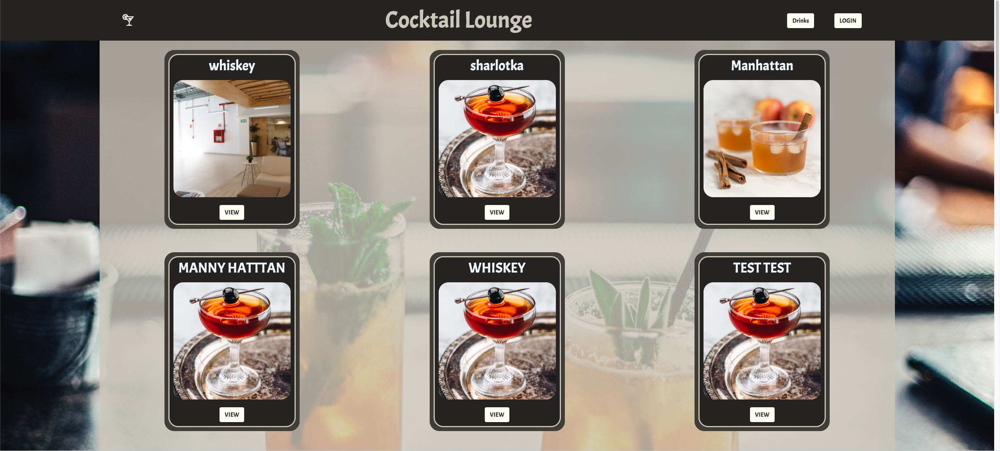

### Your Favorite Drinks/Cocktails

<h1 align="center">Models</h1>

    I have three models.
   
  Users
   
  Drinks
   
  Comments
   
  One Drink has many Comments and many ingredients
   
  One User has many comments and many Drinks
   
  Comments have one User and one Drink
  

<h1 align="center">Routes</h1>

<h1 align="center">Landing</h1>

  Simple landing page that you can log in or go to drink index
  

<h1 align="center">Drink Index</h1>

  This is the main page that shows all Drinks posted
  

<h1 align="center">Drink view</h1>

  This is the main page CRUD Page it can basically do all CRUD Actions
  

  
  <h1 align="center">Technologies Used</h1>

  HTML
     
    CSS
     
    JS
     
    MONGODB
     
    MONGOOSE
     
    ATLAS
     
  

   <h1 align="center">Getting Started</h1>

    <a href="https://cocktail-lounge-dk.herokuapp.com/">CLICK TO PLAY</a>
     
    <a href="https://trello.com/b/GFbahP7I/project-2-cocktails-board">Here's My Trello</a>
    

  <h1 align="center">Icebox</h1>

    

